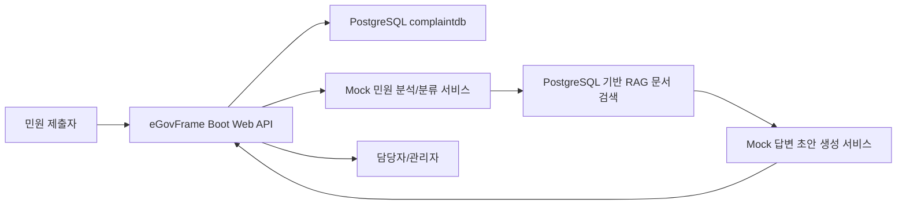

# 전자정부 표준프레임워크 기반 민원 분석 및 RAG 공문 초안 시스템 계획

## 1. 프로젝트 목표

본 프로젝트는 전자정부 표준프레임워크(eGovFrame) 5.0 기반 백엔드를 사용해 비정형 민원을 접수, 분석, 분류하고 담당자가 활용할 수 있는 공문 답변 초안을 생성하는 시스템을 목표로 한다.

현재 개발 기준에서는 민원 접수와 분석 결과 조회가 가능한 eGovFrame 기반 백엔드 골격을 확립하고, AI/RAG 기능은 비용이 발생하지 않는 Mock/PostgreSQL 로직으로 운영한다. AWS 실연동은 비용 검토 후 별도 단계에서 명시적으로 켠다.

## 2. 최종 개발 기준

전자정부프레임워크 사용이 필수 조건이므로 최종 메인 백엔드는 `egov-boot-web`이다.

- `egov-boot-web`: eGovFrame Initializr 5.0.5로 생성한 eGovFrame 5.0 기반 Maven 백엔드
- `backend`: 기존 Spring Initializr/Gradle 기반 백엔드. 참고용 또는 추후 정리 대상
- 기준 포트: `8081`
- 기준 DB: PostgreSQL `complaintdb`
- 기준 Java: 17

산출물, 발표, 실행 설명에서는 `egov-boot-web`을 기준으로 설명한다. `backend`를 메인 백엔드로 설명하지 않는다.

## 3. 시스템 개요



## 4. 백엔드 구성

백엔드는 eGovFrame Boot Web 프로젝트인 `egov-boot-web`에 구현한다.

주요 기술:

- eGovFrame Boot Starter Parent 5.0.0
- Spring Boot
- Spring MVC
- Spring Data JPA
- Spring Security
- Spring Actuator
- Flyway
- PostgreSQL JDBC Driver
- Maven

주요 패키지:

```text
egov-boot-web/src/main/java/egovframework/example/complaint
```

구현 영역:

- `api`: REST API Controller, DTO, 예외 처리
- `domain`: 민원 Entity, 상태 Enum
- `repository`: JPA Repository
- `service`: 민원 접수/조회/분석 서비스
- `config`: 보안 설정

## 5. 현재 구현 상태

현재 구현된 기능:

- 민원 접수 API
- 민원 목록/단건 조회 API
- 민원 목록 필터링 및 페이지네이션
- 민원 분석 결과 조회 API
- 민원 상태 변경 API
- 첨부파일 등록/목록 API
- 부서 목록 조회 API
- 답변 초안 생성/수정 API
- RAG 근거 문맥 조회 API
- GeoJSON 조회 API
- PostgreSQL 저장
- JPA 트랜잭션 설정
- eGovFrame 샘플 HSQLDB 설정 제거 및 PostgreSQL 기준 전환
- Spring Security 기본 허용 설정
- Actuator health endpoint
- Mock 기반 민원 유형/담당 부서 분류
- 공통 API 응답 및 공통 예외 응답
- 분석, 초안, RAG, 부서 라우팅 서비스 분리
- Flyway 기반 DB 마이그레이션
- API Key 인증 옵션
- API 감사 로그 저장
- 선택형 S3/Bedrock/OpenSearch 구현 경계 추가

주요 API:

```text
POST /api/complaints
GET  /api/complaints?status=&department=&urgency=&page=&size=
GET  /api/complaints/{id}
POST /api/complaints/{id}/attachments
GET  /api/complaints/{id}/attachments
GET  /api/complaints/{id}/attachments/{attachmentId}
DELETE /api/complaints/{id}/attachments/{attachmentId}
PATCH /api/complaints/{id}/status
GET  /api/complaints/{id}/analysis
GET  /api/complaints/{id}/draft
PUT  /api/complaints/{id}/draft
GET  /api/complaints/{id}/rag-contexts
GET  /api/complaints/{id}/geojson
GET  /api/departments
GET  /actuator/health
```

## 6. 로컬 실행 기준

DB 기준:

```text
Host: localhost
Port: 5432
Database: complaintdb
User: complaint_user
Password: complaint_pass
```

애플리케이션 설정:

```properties
server.port=8081
spring.datasource.url=jdbc:postgresql://localhost:5432/complaintdb
spring.datasource.username=complaint_user
spring.datasource.password=complaint_pass
spring.jpa.hibernate.ddl-auto=validate
spring.flyway.enabled=true
spring.flyway.baseline-on-migrate=true
management.endpoints.web.exposure.include=health,info
app.ai.provider=mock-bedrock
app.aws.s3.enabled=false
app.aws.bedrock.enabled=false
app.rag.provider=postgres-mock
app.rag.opensearch.enabled=false
app.file-storage.provider=local
```

실행:

```powershell
cd C:\Users\user\Documents\GitHub\Unstructured\egov-boot-web
mvn test
mvn spring-boot:run
```

헬스 체크:

```powershell
Invoke-WebRequest -Uri http://localhost:8081/actuator/health -UseBasicParsing
```

## 7. 요구사항 정리

기능 요구사항:

- 사용자는 민원 제목, 내용, 주소 정보를 등록할 수 있어야 한다.
- 시스템은 등록된 민원을 DB에 저장해야 한다.
- 시스템은 민원 내용을 기반으로 민원 유형과 담당 부서를 추론해야 한다.
- 담당자는 민원 상세와 분석 결과를 조회할 수 있어야 한다.
- 시스템은 관련 문서 검색 결과를 바탕으로 답변 초안을 생성해야 한다.
- 개발 기본값에서는 외부 AWS 서비스를 직접 호출하지 않아야 한다.

비기능 요구사항:

- 전자정부 표준프레임워크 기반 구조를 유지해야 한다.
- 업무 데이터는 PostgreSQL에 저장한다.
- API 계층, 서비스 계층, 저장소 계층을 분리한다.
- 예외 응답은 일관된 JSON 구조로 반환한다.
- 운영 전환 시 인증, 권한, 감사 로그, 배포 자동화 기준을 강화한다.

## 8. 향후 개발 계획

1. 민원 API 통합 테스트를 보강한다.
2. 첨부파일 다운로드/삭제 API를 추가한다.
3. 로컬 Mock 기준 통합 시나리오와 데모 데이터를 보강한다.
4. RAG용 문서 저장소와 벡터 검색 구조를 정리한다.
5. 관리자/담당자 화면 또는 별도 프론트엔드 대시보드를 연결한다.
6. AWS 실연동은 비용 검토 후 필요한 기능만 명시적으로 켠다.
7. 인증/인가 정책을 실제 사용자 역할 기준으로 구체화한다.
8. 배포 환경 기준으로 프로파일, 로그, 보안 설정을 분리한다.

## 9. 검증 상태

확인된 항목:

- PostgreSQL 컨테이너 `complaint-postgres` 실행 확인
- Maven 테스트 통과
- `mvn spring-boot:run` 실행 및 8081 포트 기동 확인
- `/actuator/health` 정상 응답 확인
- `POST /api/complaints` 민원 등록 확인
- `GET /api/complaints/{id}/analysis` 분석 결과 조회 확인
- `mvn test` 기준 컴파일 성공 확인
- 현재 개발 기본값에서 S3, Bedrock, OpenSearch Serverless를 호출하지 않도록 설정 확인

## 10. 문서화 기준

앞으로 프로젝트 문서는 다음 기준으로 유지한다.

- `README.md`: 현재 실행 방법과 프로젝트 구조 요약
- `SETUP_SUMMARY.md`: 세팅 상태와 변경해야 할 설정 요약
- `PLAN.md`: 개발 방향, 요구사항, 구현 계획

문서에서 백엔드 기준을 설명할 때는 항상 `egov-boot-web`을 기준으로 작성한다.

## 11. 2026-05-29 팀원 수정사항 파악 결과

팀원 변경 이후 프로젝트 구조와 진행상황을 재확인했다. 현재 기준 메인 서버는 `egov-boot-web`이며, 기존 `backend`는 참고용/정리 대상이다.

새로 확인된 주요 변경사항:

- `egov-boot-web`에 eGovFrame Boot Web 5.0 기반 Maven 백엔드가 추가되었다.
- 민원 도메인/API가 `egovframework.example.complaint` 패키지로 이식 및 확장되었다.
- DB 스키마가 Flyway 마이그레이션으로 전환되었다.
- `complaints`, `complaint_attachments`, `complaint_analysis`, `departments`, `knowledge_documents`, `official_drafts`, `draft_revisions`, `rag_contexts`, `audit_logs`, `api_users` 중심의 정규화 모델이 추가되었다.
- API 응답은 `ApiResponse`, 오류 응답은 `ApiError` 기반으로 정리되었다.
- 민원 목록 필터링/페이지네이션, 상태 변경, 분석 조회, GeoJSON 조회, RAG 근거 조회, 초안 생성/수정, 첨부파일 업로드/다운로드/삭제, 부서 조회 API가 구현되었다.
- 파일 저장소는 local 기본값과 S3 선택 구현으로 분리되었다.
- AI 분석/초안 생성은 Mock 기본값과 Bedrock 선택 구현으로 분리되었다.
- RAG 검색은 PostgreSQL 기반 기본 구현과 OpenSearch Serverless 선택 구현으로 분리되었다.
- API Key 인증 옵션, API 사용자 모델, 감사 로그 필터가 추가되었다.
- Dockerfile, `.dockerignore`, 운영 프로파일 `application-prod.properties`가 추가되었다.
- `ai-rag-engine` Python 모듈이 추가되어 Markdown 지식문서 기반 OpenAI RAG 실험과 `knowledge_documents` 테이블 적재를 지원한다.

현재 검증 결과:

```text
egov-boot-web: mvn -q test 통과
backend: .\gradlew.bat test 통과
ai-rag-engine: python -m py_compile main.py insert_knowledge_documents.py test_db_connection.py 통과
```

검증 시 확인된 런타임 특징:

- `egov-boot-web` 테스트는 Spring Boot 3.5.6, Spring 6.2.11, Java 17로 실행된다.
- H2 테스트 DB에 Flyway V1~V3 마이그레이션이 적용되고 API smoke test가 통과한다.
- 테스트는 민원 등록, 분석, 초안 생성/수정, RAG 조회, 부서 조회, 첨부파일 업로드/조회/다운로드/삭제 흐름을 검증한다.
- 개발 기본 설정은 S3, Bedrock, OpenSearch Serverless를 호출하지 않는다.

역할 정리:

```text
egov-boot-web:
최종 메인 백엔드. 발표/산출물/실행 설명 기준.

ai-rag-engine:
Python 기반 AI/RAG 실험 및 지식문서 적재 도구. OpenAI API 사용 시 비용 발생 가능.

backend:
초기 Spring Boot/Gradle 백엔드. 현재는 참고용 또는 삭제 검토 대상.
```

다음 우선순위:

1. `backend`를 유지할지 삭제할지 팀 기준으로 결정한다.
2. 프론트엔드/대시보드를 `egov-boot-web` API에 연결한다.
3. API 문서, DBeaver 확인 쿼리, 데모 시나리오를 정리한다.
4. `ai-rag-engine`에서 적재한 지식문서를 `egov-boot-web`의 PostgreSQL RAG 검색과 연결해 데모 데이터를 보강한다.
5. AWS 실연동은 비용 검토 후 S3, Bedrock, OpenSearch 순서로 별도 활성화한다.
